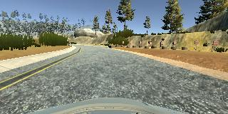
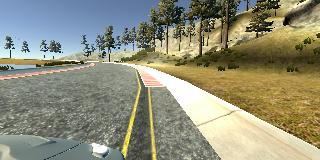
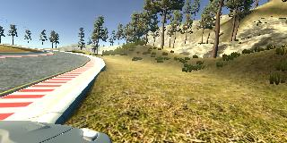
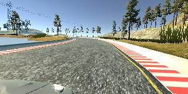
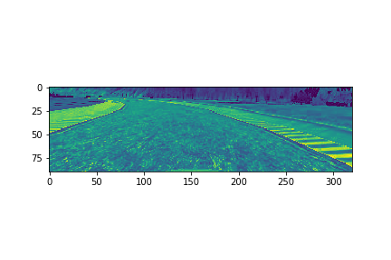
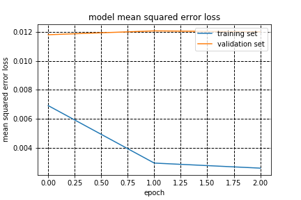

# **Behavioral Cloning** 

## Intro.

**Behavioral Cloning Project**

본 프로젝트의 목표 및 수행한 step은 아래와 같습니다.:
* Use the simulator to **collect data** of good driving behavior
* Build, a convolution neural network in **Keras** that predicts steering angles from images
* Train and validate the model with a training and validation set
* Test that the model successfully **drives around track** one without leaving the road
* Summarize the results with a written report

## Rubric Points
프로젝트 구현 과정에서 아래 사항에 대해 고려하면서 작업을 수행했습니다. [rubric points](https://review.udacity.com/#!/rubrics/432/view)

각각의 항목이 어떻게 구현되었는지는 아래 설명을 통해 보여드리겠습니다. 

---
## Files Submitted & Code Quality

### 1. Submission includes all required files and can be used to run the simulator in autonomous mode

해당 프로젝트의 구성 파일은 아래와 같습니다.
* model.py : containing the script to create and train the model
* drive.py : for driving the car in autonomous mode
* model.h5 : containing a trained convolution neural network 
* writeup_report.md : summarizing the results

### 2. Submission includes functional code
Udacity에서 제공하는 simulator를 통해 drive.py file을 실행하면 track을 자율 주행하는 것을 확인 할 수 있습니다.

terminal 에 아래와 같이 작성하시고, 시뮬레이터에서 autonomous driving 모드로 진입하시면 됩니다. 
```sh
python drive.py model.h5
```

## Model Architecture and Training Strategy

### 1. An appropriate model architecture has been employed

<center></center>

처음 적용한 모델은 기존 수업에 사용했었던 LeNet을 적용하여 수행했습니다.

### 2. Attempts to reduce overfitting in the model

The model contains dropout layers in order to reduce overfitting (model.py lines 112,117). 

The model was trained and validated on different data sets to ensure that the model was not overfitting (code line 129). The model was tested by running it through the simulator and ensuring that the vehicle could stay on the track.

### 3. Model parameter tuning

The model used an adam optimizer, so the learning rate was not tuned manually (model.py line 141).

### 4. Appropriate training data

처음 모델을 학습하고 수행할 때에는 최대한 track의 정중앙으로 운행한 1-lap의 데이터를 이용했습니다.

하지만, 자율주행 모드에서 한번 track을 벗어날 경우 다시 복귀하는 동작이 불가능한 것을 깨닫고

임의로 학습 데이터에 track을 벗어났다가 복귀하는 운행을 추가하였습니다.

그리고 추가적으로 역주행으로 1 lap을 데이터에 추가하였습니다.

학습 데이터에 대한 좀 더 자세한 내용은 마지막 부분에 정리에서 한번에 보여 드리겠습니다.


## Model Architecture and Training Strategy

### 1. Solution Design Approach

LeNet 모델을 적용한 이후에 실제로 시뮬레이터를 통해 AD 주행을 하였을 때, 자동차의 운행이 매끄럽게 진행되지 않음을 확인했습니다.

그래서 수업에서 소개된 소개된 새로운 모델을 적용했고,

그 결과 기존 대비 track을 벗어나는 횟수가 줄어드는 것을 확인했습니다.


### 2. Final Model Architecture

구현한 모델은 수업 중에 배운 nVidia 모델을 이용하였습니다.

The final model architecture (model.py lines 102-119) consisted of a convolution neural network with the following layers and layer sizes .

일부분은 data에 맞게 그리고 dropout을 추가하기 위해 수정했습니다.

| Layer     |     Description   |
|:---------------------:|:---------------------------------------------:|
| Input         | 160x320x3 RGB image   |
| Normalization | outputs 160x320x3     |
| Corpping2D    |  outputs 90x320x3     |
| Convolution 5x5   | 2x2 stride, Valid padding, outputs 43x158x24 |
| RELU          |                       |
| Convolution 5x5   | 2x2 stride, Valid padding, outputs 20x77x36   |
| RELU          |                       |
| Convolution 5x5   | 2x2 stride, Valid padding, outputs 8x37x48    |
| RELU          |                       |
| Convolution 5x5   | 2x2 stride, Valid padding, outputs 6x35x64    |
| RELU          |                       |
| Convolution 5x5   | 2x2 stride, Valid padding, outputs 4x33x36    |
| RELU          |                       |
| Dropout       | 0.25                  |
| Flatten       | input 4x33x64, outputs 8448                       |
| Fully connected   | input 8448, output 100                        |
| Fully connected   | input 100, output 50                          |
| Fully connected   | input 50, output 10                           |
| Dropout           | 0.25                                          |
| Fully connected   | input 10, output 1                            |

architecture의 도식화된 그림은 아래와 같습니다.
(note: visualizing the architecture is optional according to the project rubric)

<center></center>

### 3. Creation of the Training Set & Training Process

To capture good driving behavior, I first recorded two laps on track one using center lane driving. Here is an example image of center lane driving:

총 2번의 lap으로 데이터를 구성했고, 최대한 도로의 중앙으로 운행할 수 있도록 하였습니다.

<center></center>

I then recorded the vehicle recovering from the left side and right sides of the road back to center. 앞서 언급하였듯이 한번 자동차가 도로 밖으로 나가게 되면 그대로 retire 하게 되는 경우를 발견하였습니다. 이를 해결하기 위해 데이터에 recovery 운행에 대해 추가하였습니다.  

아래 예시 이미지는 도로 오른쪽 밖으로 나가는 경우에 대한 예시 입니다.

<center></center>
<center></center>
<center></center>

또한, 데이터 셋에 augment 를 위해 좌우로 flip 작업을 추가하였습니다. 

After the collection process, I had 10108 number of data points. I then preprocessed this data. 중요한 부분만 보기 위해 Cropping2D 로 일부 데이터를 잘랐습니다.

해당 기능을 두번째 preprocessing인 normalization 전에 수행한 이유는 udacity review의 comment와 같이 불필요한 부분은 미리 버려 연산량을 줄위기 위해 제일 먼저 수행하였습니다.

<center></center>


I finally randomly shuffled the data set and put 20% of the data into a validation set. 

I used this training data for training the model. The validation set helped determine if the model was over or under fitting. The ideal number of epochs was 2. 

 I used an adam optimizer so that manually training the learning rate wasn't necessary.

 accuracy 결과는 아래와 같이 나왔습니다.

 <center></center>

해당 모델을 이용하여 최종적으로 수행한 1 lap 자율주행 결과는 아래 동영상과 같습니다.

[](https://youtu.be/z4rIIFeOBak?t=0s)
